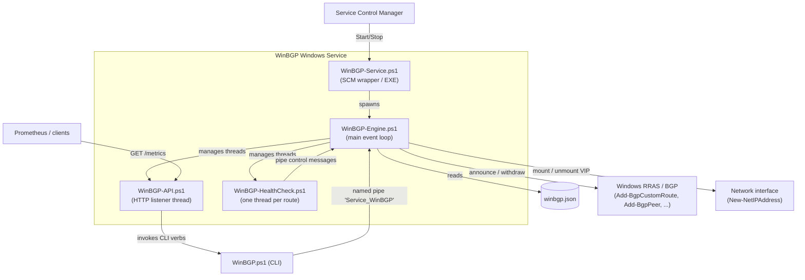
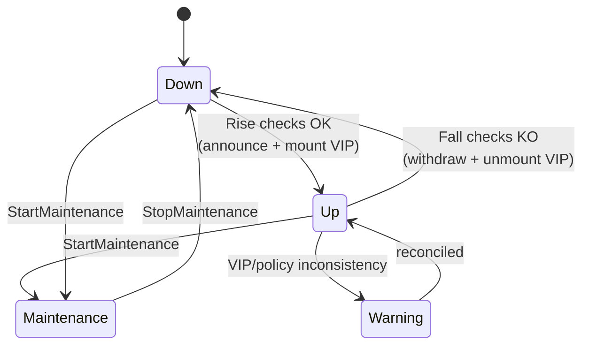

<div align="center">

# WinBGP

**The BGP swiss army knife of networking on Windows**

A pure-PowerShell Windows service that turns a Windows Server into a dynamic,
health-checked BGP route announcer — with a CLI, a REST API and Prometheus metrics.


[Project on GitHub](https://github.com/webalexeu/winbgp)

</div>

---

## Table of contents

- [Overview](#overview)
- [Key features](#key-features)
- [Architecture](#architecture)
- [Components](#components)
- [Prerequisites](#prerequisites)
- [Installation](#installation)
- [Configuration](#configuration)
  - [Global settings](#global-settings)
  - [API](#api-configuration)
  - [Router](#router)
  - [Peers](#peers)
  - [Routes](#routes)
  - [Health-check methods](#health-check-methods)
- [Route lifecycle & status](#route-lifecycle--status)
- [Command line interface (CLI)](#command-line-interface-cli)
- [REST API](#rest-api)
- [Prometheus metrics](#prometheus-metrics)
- [Logging](#logging)
- [Building the MSI](#building-the-msi)
- [Project layout](#project-layout)
- [Credits](#credits)

---

## Overview

WinBGP runs as a native Windows service and manages BGP route announcements on
top of the built-in **Remote Access / Routing (RRAS)** BGP feature. It reads a
single JSON configuration file describing the local router, its BGP peers and the
routes (VIPs) to announce. For each route it can:

- Mount/unmount the associated IP address on a network interface (dynamic VIP).
- Announce/withdraw the route to all configured BGP peers.
- Continuously run a **health check** and automatically withdraw the route when
  the monitored resource goes down (`WithdrawOnDown`).
- Be placed in **maintenance** to gracefully drain traffic.

Everything is scriptable through a CLI, controllable over a local REST API, and
observable via Windows Event Log and Prometheus metrics.

> WinBGP is a good fit for anycast VIPs, active/active service front-ends, and
> highly available on-prem services that need to be advertised (or withdrawn)
> based on their real health.

---

## Key features

| Feature | Description |
| --- | --- |
| Pure PowerShell service | No compiled agent; a thin `.exe` wrapper invokes the PowerShell engine. |
| Dynamic VIP management | Automatically adds/removes the route IP on the chosen interface (`DynamicIpSetup`). |
| Health-check driven | Announce/withdraw a route based on `service`, `process`, `tcp`, `cluster` or `custom` checks. |
| Rise/Fall thresholds | Debounced state changes (configurable number of consecutive checks). |
| Maintenance mode | Gracefully drain a route without stopping the service. |
| Hot reload | Apply configuration changes (routes, peers, policies, API) without a restart. |
| REST API | Query status and drive operations over HTTP. |
| Prometheus metrics | `/metrics` endpoint exposing peer and route state. |
| Signed MSI | Standard installation with WiX; binaries and installer can be Authenticode-signed. |

---

## Architecture



**Interaction model**

- The **engine** is the long-running process. It owns an event loop driven by a
  timer and a **named pipe** (`Service_WinBGP`). Control messages
  (`reload`, `route <name> start|stop`, `maintenance <name> start|stop`,
  `healthcheck <name> start|stop|restart`, `stop`, ...) are received on this pipe.
- The **CLI** (`WinBGP.ps1`) and the **API** never touch BGP directly for
  mutations — they translate user intent into pipe messages sent to the engine,
  which serializes all state changes in its single event loop.
- Each route with `WithdrawOnDown = true` gets its own **health-check thread**
  that, on state transition, sends `route <name> start|stop` messages back to the
  engine.
- The **API** runs in a dedicated thread hosting an `HttpListener`.

---

## Components

| File | Role |
| --- | --- |
| [service/WinBGP-Service.ps1](../service/WinBGP-Service.ps1) | Service bootstrap / SCM integration. Handles `-Setup`, `-Remove`, `-Start`, `-Stop`, `-Status` and the internal `-SCMStart/-SCMStop/...` verbs. Generates the `WinBGP-Service.exe` wrapper. Based on JFLarvoire's `PSService.ps1`. |
| [src/WinBGP-Engine.ps1](../src/WinBGP-Engine.ps1) | The core engine: main event loop, pipe handler, config validation & hot reload, BGP/IP management, health-check and API thread lifecycle. |
| [src/WinBGP-API.ps1](../src/WinBGP-API.ps1) | HTTP listener exposing the REST API and the Prometheus `/metrics` endpoint. Based on stevelee's `HttpListener`. |
| [src/WinBGP-HealthCheck.ps1](../src/WinBGP-HealthCheck.ps1) | Per-route health-check worker with rise/fall debouncing. |
| [src/WinBGP.ps1](../src/WinBGP.ps1) | The `WinBGP` CLI to query status and drive operations locally (installed as `C:\Program Files\WinBGP\WinBGP.ps1`). |
| [src/winbgp.json.example](../src/winbgp.json.example) | Example configuration file. |
| [builder/build.ps1](../builder/build.ps1) | Build script producing the signed MSI via WiX. |
| [builder/main.wxs](../builder/main.wxs) / [builder/files.wxs](../builder/files.wxs) | WiX packaging definitions. |

---

## Prerequisites

- **Windows Server 2016, 2019, 2022 or 2025**
- **PowerShell 5.1**
- The **Remote Access / Routing** feature must be installed and routing enabled.
  WinBGP checks this at startup and refuses to run otherwise:

  ```powershell
  # Install the Routing feature (RRAS)
  Install-WindowsFeature RemoteAccess, Routing -IncludeManagementTools
  Install-RemoteAccess -VpnType RoutingOnly
  ```

  WinBGP validates `(Get-RemoteAccess).RoutingStatus -eq 'Installed'` on start.

---

## Installation

Standard MSI installation. The MSI installs the service files under
`C:\Program Files\WinBGP\`, registers the `WinBGP` service and creates the
required firewall rule for the API.

```powershell
# Install
msiexec /i WinBGP-<version>-amd64.msi /qn

# The configuration file lives here:
#   C:\Program Files\WinBGP\winbgp.json

# Manage the service
WinBGP -Status
WinBGP -Start
WinBGP -Stop
```

> After installation, copy `winbgp.json.example` to
> `C:\Program Files\WinBGP\winbgp.json`, adapt it to your environment, then start
> the service.

---

## Configuration

WinBGP is driven by a single JSON file (`winbgp.json`). The engine validates the
whole file before (re)loading it; an invalid file aborts the reload and, at
startup, stops the service. See [src/winbgp.json.example](../src/winbgp.json.example).

```jsonc
{
  "global": {
    "Interval": 5,      // Health-check interval (seconds)
    "Timeout": 1,       // Check timeout (seconds)
    "Rise": 3,          // Consecutive OK checks before a route is announced
    "Fall": 2,          // Consecutive KO checks before a route is withdrawn
    "Metric": 100,      // Default BGP MED
    "Api": true         // Enable the REST API
  },
  "api": [
    { "Uri": "http://127.0.0.1:8888", "AuthenticationMethod": "Anonymous" }
  ],
  "router": {
    "BgpIdentifier": "YOUR_IP",
    "LocalASN": "YOUR_ASN"
  },
  "peers": [
    {
      "PeerName": "Peer1",
      "LocalIP": "YOUR_IP",
      "PeerIP": "Peer1_IP",
      "LocalASN": "YOUR_ASN",
      "PeerASN": "Peer1_ASN"
    }
  ],
  "routes": [
    {
      "RouteName": "mywinbgpservice.contoso.com",
      "Network": "10.0.0.10/32",
      "Interface": "Ethernet",
      "DynamicIpSetup": true,
      "WithdrawOnDown": true,
      "WithdrawOnDownCheck": "service: W32Time",
      "NextHop": "YOUR_IP",
      "Community": [ "BGP_COMMUNITY" ]
    }
  ]
}
```

### Global settings

| Key | Type | Description |
| --- | --- | --- |
| `Interval` | int | Default seconds between health checks (can be overridden per route). |
| `Timeout` | int | Check timeout in seconds. |
| `Rise` | int | Number of consecutive successful checks before announcing a route. |
| `Fall` | int | Number of consecutive failed checks before withdrawing a route. |
| `Metric` | int | Default BGP MED applied via the routing policy. |
| `Api` | bool | Enable/disable the REST API. Toggling it live starts/stops the API thread. |

### API configuration

`api` is an array of listeners. Each entry:

| Key | Type | Description |
| --- | --- | --- |
| `Uri` | string | Listener prefix, e.g. `http://127.0.0.1:8888`. |
| `AuthenticationMethod` | string | `Anonymous` or `Negotiate` (Kerberos/NTLM). Local requests are always allowed. |

### Router

| Key | Type | Description |
| --- | --- | --- |
| `BgpIdentifier` | string | The local BGP router ID (usually the local IP). |
| `LocalASN` | string | The local autonomous system number. |

### Peers

Array of BGP neighbors:

| Key | Type | Description |
| --- | --- | --- |
| `PeerName` | string | Friendly peer name. |
| `LocalIP` | string | Local IP used for the BGP session. |
| `PeerIP` | string | Neighbor IP. |
| `LocalASN` | string | Local ASN. |
| `PeerASN` | string | Neighbor ASN. |

### Routes

Array of advertised networks (VIPs):

| Key | Type | Description |
| --- | --- | --- |
| `RouteName` | string | Unique route identifier (used by the CLI/API). |
| `Network` | string | CIDR to announce, e.g. `10.0.0.10/32`. |
| `Interface` | string | Interface alias where the VIP is mounted. |
| `DynamicIpSetup` | bool | If `true`, WinBGP mounts/unmounts the IP on the interface (SkipAsSource). |
| `WithdrawOnDown` | bool | If `true`, run a health check and withdraw the route on failure. |
| `WithdrawOnDownCheck` | string | Health check definition (`method: value`) — required when `WithdrawOnDown` is `true`. |
| `NextHop` | string | BGP next hop advertised in the routing policy. |
| `Community` | array | BGP communities to attach. |
| `Interval` | int | *(optional)* Per-route health-check interval override. |
| `Metric` | int | *(optional)* Per-route MED override. |
| `Rise` / `Fall` | int | *(optional)* Per-route thresholds override. |

### Health-check methods

`WithdrawOnDownCheck` uses the format `"<method>: <value>"`:

| Method | Example | Behavior |
| --- | --- | --- |
| `service` | `service: W32Time` | OK when the Windows service is `Running`. |
| `process` | `process: myapp` | OK when at least one process with that name exists. |
| `tcp` | `tcp: 127.0.0.1:443` | OK when a TCP connection to `host:port` succeeds. |
| `cluster` | `cluster: MyResource` | OK when the failover-cluster resource is `Online` on this node. |
| `custom` | `custom: if ((...)) {return $true} else {return $false}` | Runs a custom PowerShell expression that **must** return a Boolean. |

State changes are debounced: a route is announced only after `Rise` consecutive
successes and withdrawn after `Fall` consecutive failures.

---

## Route lifecycle & status

A route reported by `WinBGP` (or the API) has one of the following statuses:

| Status | Meaning |
| --- | --- |
| `up` | Route announced, policy present and (if dynamic) VIP mounted. |
| `down` | Route not announced. |
| `warning` | Partially configured (e.g. VIP not mounted, or missing routing policy). |
| `maintenance` | Route manually drained; kept withdrawn regardless of health. |



---

## Command line interface (CLI)

Once installed, the `WinBGP` command is available (wrapper around
`C:\Program Files\WinBGP\WinBGP.ps1`).

**Service control**

```powershell
WinBGP -Status        # Not installed / Stopped / Running
WinBGP -Start
WinBGP -Stop
WinBGP -Restart
WinBGP -Version
```

**Status & introspection**

```powershell
WinBGP                # Default: BGP status (per-route Name/Network/Status/MaintenanceTimestamp)
WinBGP -Config        # Show the current configuration
WinBGP -Logs -Last 20 # Show the last N log entries
```

**Route operations** (per route, via `-RouteName`)

```powershell
WinBGP -RouteName mywinbgpservice.contoso.com -StartRoute
WinBGP -RouteName mywinbgpservice.contoso.com -StopRoute

WinBGP -RouteName mywinbgpservice.contoso.com -StartMaintenance
WinBGP -RouteName mywinbgpservice.contoso.com -StopMaintenance

WinBGP -RouteName mywinbgpservice.contoso.com -StartHealthCheck
WinBGP -RouteName mywinbgpservice.contoso.com -StopHealthCheck
WinBGP -RouteName mywinbgpservice.contoso.com -RestartHealthCheck
```

**Configuration / API**

```powershell
WinBGP -Reload        # Validate and hot-reload winbgp.json
WinBGP -RestartAPI    # Restart the API thread
```

> `-RouteName` supports tab-completion sourced from `winbgp.json`.
> Operations return `Success`, `WinBGP not ready`, or `Route '<name>' not found`.

---

## REST API

When `global.Api` is enabled, the engine hosts an HTTP listener at the configured
`Uri` (default `http://127.0.0.1:8888`). Local requests bypass authentication;
remote requests honor the configured `AuthenticationMethod`.

### GET endpoints

| Endpoint | Description |
| --- | --- |
| `GET /api` | Liveness — `{ "message": "WinBGP API running" }`. |
| `GET /api/config` | Full configuration. |
| `GET /api/config/<section>` | A single config section (`global`, `router`, `peers`, `routes`, `api`). |
| `GET /api/logs?Last=<n>` | Last `n` log entries (default 10). |
| `GET /api/peers` | All BGP peers with connectivity status. |
| `GET /api/peers/<PeerName>` | A single peer. |
| `GET /api/router` | Local BGP router info. |
| `GET /api/routes` | All routes with status and maintenance timestamp. |
| `GET /api/routes/<RouteName>` | A single route. |
| `GET /api/statistics` | BGP statistics (via CIM `PS_BgpStatistics`). |
| `GET /api/status` | Service status — `{ "service": "Running" }`. |
| `GET /api/version` | CLI version. |
| `GET /metrics` | Prometheus exposition format. |

### POST endpoints

Operations take the route via the `RouteName` query-string parameter.

| Endpoint | Description |
| --- | --- |
| `POST /api/Reload` | Hot-reload the configuration. |
| `POST /api/StartRoute?RouteName=<name>` | Announce a route. |
| `POST /api/StopRoute?RouteName=<name>` | Withdraw a route. |
| `POST /api/StartMaintenance?RouteName=<name>` | Put a route in maintenance. |
| `POST /api/StopMaintenance?RouteName=<name>` | Remove a route from maintenance. |
| `POST /stop` | Stop the API listener (local requests only). |

**Examples**

```powershell
# Status of all routes
Invoke-RestMethod http://127.0.0.1:8888/api/routes

# Drain a route
Invoke-RestMethod -Method POST "http://127.0.0.1:8888/api/StartMaintenance?RouteName=mywinbgpservice.contoso.com"

# Reload config
Invoke-RestMethod -Method POST http://127.0.0.1:8888/api/Reload
```

POST responses return `{ "output": "Success" }` (HTTP 200) or
`{ "output": "WinBGP not ready" }` (HTTP 500).

---

## Prometheus metrics

`GET /metrics` exposes gauges suitable for scraping:

| Metric | Labels | Description |
| --- | --- | --- |
| `winbgp_state_peer` | `local_asn, local_ip, name, peer_asn, peer_ip, state` | 1 for the peer's current state (`connected`, `connecting`, `stopped`), else 0. |
| `winbgp_state_route` | `family, maintenance_timestamp, name, network, state` | 1 for the route's current state (`up`, `down`, `maintenance`, `warning`), else 0. |

Example scrape config:

```yaml
scrape_configs:
  - job_name: winbgp
    static_configs:
      - targets: ["winbgp-host:8888"]
    metrics_path: /metrics
```

---

## Logging

WinBGP writes to the **Windows Event Log** (`Application` log, source `WinBGP`,
plus per-component sources `WinBGP-API`). Per-route entries carry the route name
as an additional event field. Retrieve recent entries with:

```powershell
WinBGP -Logs -Last 50
# or
Get-EventLog -LogName Application -Source WinBGP -Newest 50
```

---

## Building the MSI

The MSI is produced with the [WiX Toolset](https://wixtoolset.org/) (v4+) via
[builder/build.ps1](../builder/build.ps1).

```powershell
cd builder

# Unsigned build
.\build.ps1 -Version v1.1.4 -Arch amd64

# Signed build (binaries + MSI)
.\build.ps1 -Version v1.1.4 -Arch amd64 -Sign -CertificateThumbprint <thumbprint>
```

The script:

1. Copies all `src/*.ps1` scripts into a temporary `engine` folder (Authenticode-signing them when `-Sign` is used).
2. Runs `wix build` with the Firewall, UI and Util extensions to create `WinBGP-<version>-<arch>.msi`.
3. Signs the MSI with `signtool.exe` when `-Sign` is used and copies it to `release/`.

Supported architectures: `amd64` (x64) and `arm64`.

---

## Project layout

```
WinBGP/
├── builder/                 # MSI build (WiX) + build script
│   ├── build.ps1
│   ├── files.wxs
│   └── main.wxs
├── service/
│   └── WinBGP-Service.ps1   # SCM wrapper / service bootstrap
├── src/
│   ├── WinBGP.ps1           # CLI
│   ├── WinBGP-Engine.ps1    # Core engine (event loop)
│   ├── WinBGP-API.ps1       # REST API + Prometheus metrics
│   ├── WinBGP-HealthCheck.ps1
│   └── winbgp.json.example  # Sample configuration
├── CHANGELOG.md
├── LICENCE
└── README
```

---

## Credits

- Service framework based on **JFLarvoire**'s
  [`PSService.ps1`](https://github.com/JFLarvoire/SysToolsLib) (event-driven
  service with named-pipe control).
- HTTP listener based on **stevelee**'s
  [`HttpListener`](https://www.powershellgallery.com/packages/HttpListener).
- Copyright © 2024 **Alexandre JARDON | Webalex System**. All rights reserved.
- Project: [github.com/webalexeu/winbgp](https://github.com/webalexeu/winbgp) —
  see [LICENSE](https://github.com/webalexeu/winbgp/blob/master/LICENSE).
